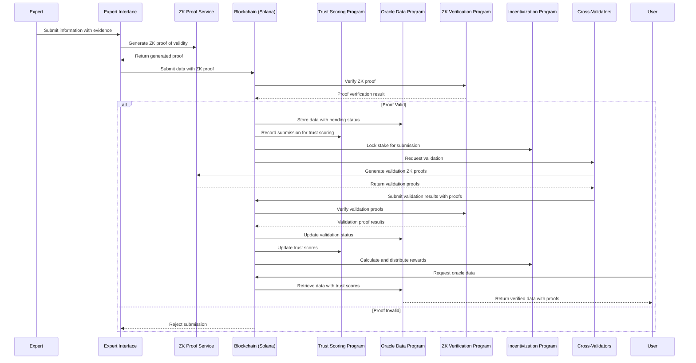

# Zero-Knowledge Oracle System: Data Flow Diagram

This sequence diagram illustrates the data flow through the Zero-Knowledge Oracle System:

1. An expert submits information through the Expert Interface
2. The ZK Proof Service generates a proof of validity without revealing sensitive details
3. The data and proof are submitted to the Solana blockchain
4. The ZK Verification Program validates the proof
5. If valid, the Oracle Data Program stores the data with a pending status
6. Cross-validators are requested to validate the information
7. Validators generate their own ZK proofs of validation
8. The system updates trust scores and validation status based on results
9. Rewards are calculated and distributed according to the incentivization rules
10. Users can request and retrieve oracle data with associated trust scores and proofs
11. If the initial proof is invalid, the submission is rejected

This flow ensures that all information is verified and processed with privacy-preserving mechanisms at every step.
