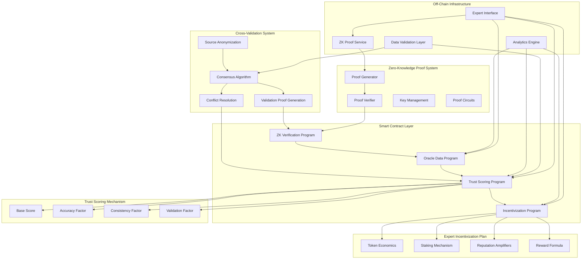

# Zero-Knowledge Oracle System on Solana: System Architecture

This diagram illustrates the core components of the Zero-Knowledge Oracle System on Solana and their interactions:

1. **Smart Contract Layer**: The on-chain Solana programs that handle trust scoring, oracle data, incentivization, and ZK verification.
2. **Zero-Knowledge Proof System**: Responsible for generating and verifying proofs without revealing sensitive information.
3. **Off-Chain Infrastructure**: User interfaces and services that interact with the blockchain.
4. **Trust Scoring Mechanism**: The system for calculating and updating trust scores for information sources.
5. **Expert Incentivization Plan**: The token economics and reward structures for encouraging participation.
6. **Cross-Validation System**: The mechanism for validating information through consensus while preserving anonymity.

The arrows indicate the flow of data and interactions between components.
