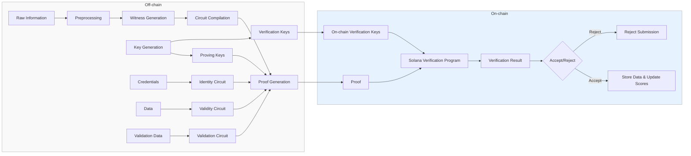

# Zero-Knowledge Proof System Workflow

This diagram illustrates the complete workflow of the Zero-Knowledge Proof system:

## Off-chain Components:

1. **Raw Information**: The initial data provided by experts
2. **Preprocessing**: Converting raw data into a format suitable for ZK proof generation
3. **Witness Generation**: Creating witnesses (private inputs) for the ZK circuits
4. **Circuit Compilation**: Compiling the appropriate circuit based on the type of proof needed
5. **Key Generation**: Creating proving and verification keys for the circuits
6. **Circuit Types**:
   - **Identity Circuit**: For proving expert credentials without revealing identity
   - **Validity Circuit**: For proving data validity without revealing sources
   - **Validation Circuit**: For proving correct validation without revealing methodology
7. **Proof Generation**: Generating the ZK proof using the compiled circuit, witness, and proving key

## On-chain Components:

1. **Verification Keys**: Stored on-chain for verifying submitted proofs
2. **Proof Submission**: The proof is submitted to the Solana blockchain
3. **Verification Program**: Verifies the proof using the verification key
4. **Verification Result**: The result of the verification process
5. **Decision Logic**: Based on the verification result, the system either:
   - Accepts the submission, stores the data, and updates relevant scores
   - Rejects the submission and provides feedback

This workflow ensures that all sensitive information remains private while still allowing the system to verify the validity and integrity of submitted data.
